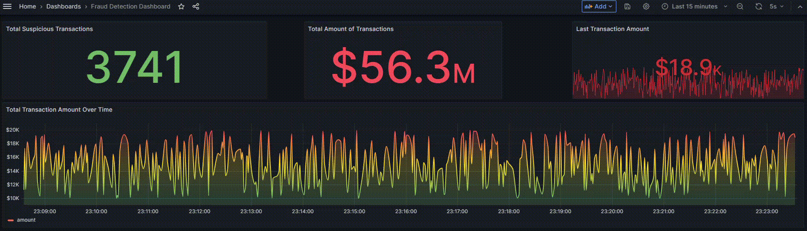
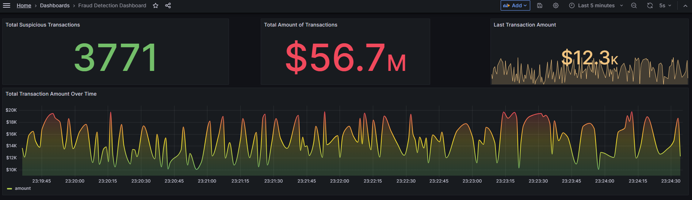
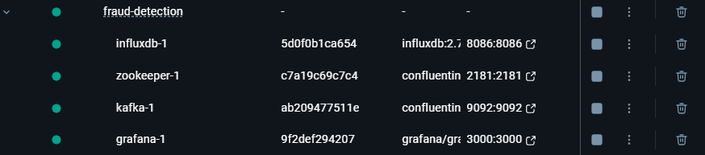
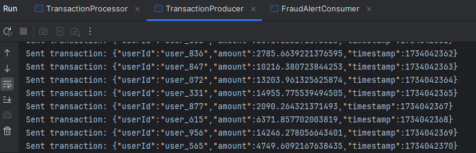
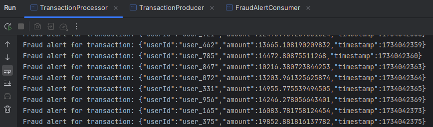
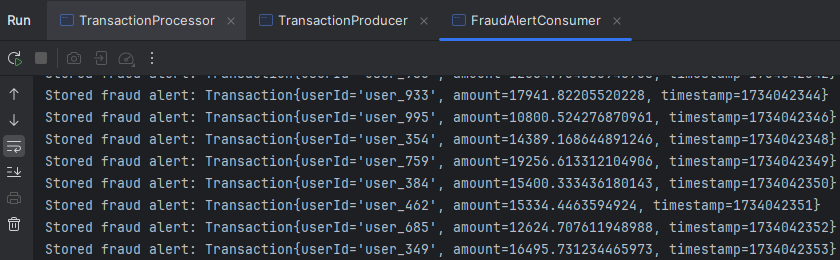
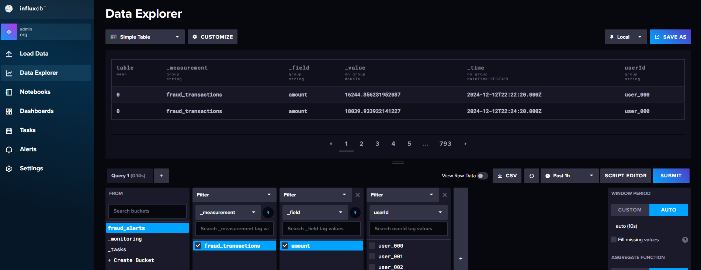
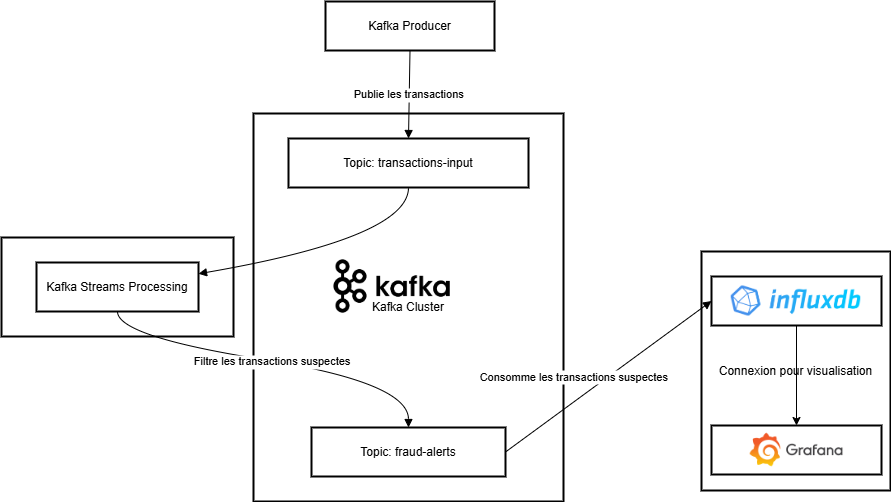

# DEMO - Application Java de Détection de Fraude en Temps Réel avec Kafka Streams, InfluxDB et Grafana

Ce projet met en œuvre un pipeline de détection de fraude en temps réel en utilisant Kafka Streams, InfluxDB et Grafana. Le système traite les transactions financières, détecte les transactions suspectes basées sur des règles prédéfinies, stocke les résultats dans InfluxDB et visualise les données en temps réel via des tableaux de bord Grafana. Cette démo met l'accent sur l'utilisation conjointe de Kafka Streams, InfluxDB et Grafana.



## Fonctionnalités
1. **Application Kafka Streams**:
    - Lit les transactions financières au format JSON à partir du topic `transactions-input`.
    - Détecte les transactions suspectes (montants supérieurs à 10 000).
    - Publie les transactions suspectes dans le topic `fraud-alerts`.

2. **Stockage en Temps Réel**:
    - Les transactions suspectes sont stockées dans une base de données **InfluxDB** pour un suivi en temps réel.

3. **Tableau de Bord Interactif**:
    - Grafana est utilisé pour afficher les données en temps réel avec des métriques telles que :
        - Nombre total de transactions suspectes.
        - Montant total des transactions.
        - Transactions suspectes au fil du temps.



4. **Déploiement**:
    - Un fichier `docker-compose.yml` pour un déploiement de Kafka, InfluxDB et Grafana.



## Étapes d’Implémentation

### 1. Application Kafka Streams
- Développement de l'application Kafka Streams pour :
    - Produire les transactions financières (Producer).
    - Filtrer les transactions suspectes (Processor).
    - Consommer les transactions suspectes (Consumer).







### 2. Configuration des Topics Kafka
- Configurer Kafka avec deux topics :
    - **`transactions-input`** : Contient les transactions brutes.
    - **`fraud-alerts`** : Stocke les transactions suspectes.

### 3. Stocker les Transactions Suspectes dans InfluxDB
- Insertion des transactions suspectes directement dans InfluxDB avec des champs tels que :
    - `userId`
    - `amount`
    - `timestamp`



### 4. Tableau de Bord Grafana
- Configuration de Grafana pour se connecter à InfluxDB et visualiser les transactions suspectes.


## Aperçu de l’Architecture
1. **Kafka Streams** : Traite les données de transaction entrantes et applique les règles de détection de fraude.
2. **InfluxDB** : Stocke les transactions suspectes pour analyse et visualisation.
3. **Grafana** : Fournit un tableau de bord interactif et en temps réel pour le suivi.



## Instructions pour Lancer le Projet
1. Cloner le dépôt :
   ```bash
   git clone https://github.com/elmouaddibe/java-kafka-influxdb-grafana.git
   ```
2. S’assurer que Docker et Docker Compose sont installés.
3. Lancer l’application :
   ```bash
   docker-compose up -d
   ```
4. Accéder au tableau de bord Grafana sur `http://localhost:3000`.
5. Utiliser le tableau de bord prédéfini pour surveiller les transactions suspectes en temps réel.
